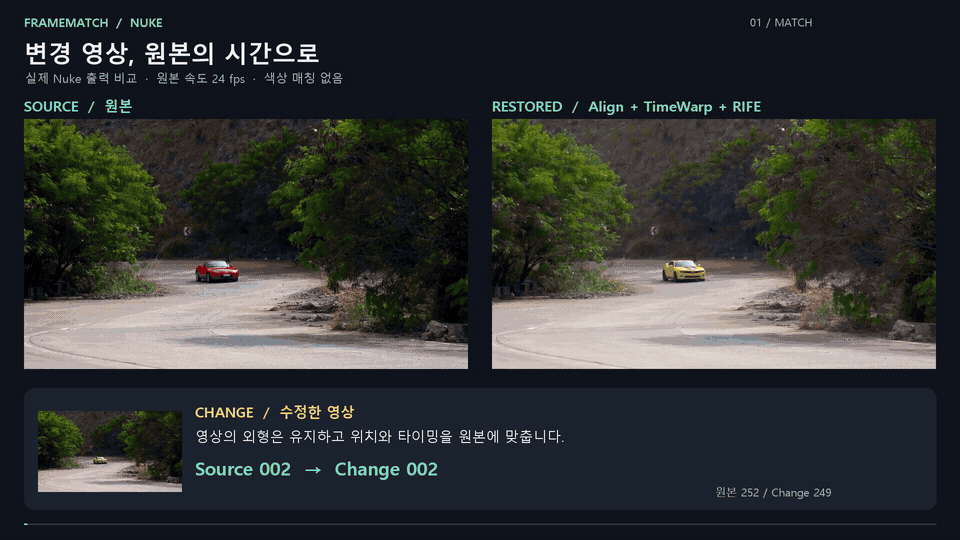

# FrameMatch for Nuke

[한국어](README.md) · [English](README.en.md)

Align an edited clip to its original timeline and fill missing frames.

[Watch the full demo](docs/media/FrameMatch_Demo.mp4)

**Align → TimeWarp → RIFE** — analyze in one node, then export editable Nuke nodes. No color matching is applied.

## Get started

1. Download **FrameMatch-Windows.zip** from the [latest release](https://github.com/tardis7732/FrameMatch-for-Nuke/releases/latest) and extract it.
2. Install NukeX and [Cattery RIFE](https://github.com/rafaelperez/RIFE-for-Nuke#installation). RIFE model weights are installed separately.
3. Run `Open_FrameMatch_NukeX.cmd` → Tab → **FrameMatch**.

## Usage

1. Connect the edited clip to **Change** and the original to **Source**. Connect Mask only if needed for Align.
2. Set the start and end of **Source range / Change range**. Each **Reset** reads the corresponding input range. Source defines the output timeline.
3. To align spatially, choose a **Reference frame** and click **Analyze align**. **Current** selects the current frame; **Use mask** applies only to Align. Real MatchGrade analysis creates **Transform → Reformat** below Change.
4. Click **Analyze timing**. It uses stored Align if available, otherwise raw Change; it does not automatically solve new alignment. On completion, **TimeWarp → RIFE** is connected.
5. Connect the Viewer to the generated RIFE output. FrameMatch itself stores analysis data and passes Change through unchanged.

### Export

| Button | Output |
| --- | --- |
| **Align** | Transform + Reformat as one set |
| **TimeWarp** | Frame mapping onto the Source timeline |
| **RIFE** | Gap interpolation Group; connect after the corresponding TimeWarp |
| **Export all** | Align → TimeWarp → RIFE, or TimeWarp → RIFE without stored Align |

Analyze creates or updates connected outputs. Manual exports are independent copies with the first input disconnected; Export all connects only the exported nodes together. Keep the original edited clip connected to Change.

### RIFE and Results

RIFE takes **one input** and samples both valid endpoints from it. Missing frame 155 uses 154 and 156; missing frames 155–157 use 154 and 158 to generate three frames. Gaps without both endpoints remain unfilled.

The bottom **Results** panel shows Matched / Missing, fillable RIFE frames, Without endpoints, and uncertain Review candidates. Settings for RIFE GPU, detail, and resolution apply to newly exported outputs.

See the [full guide](docs/USAGE.en.md) for installation paths, mask behavior, result definitions, and troubleshooting.

## Example

Extract **FrameMatch-Sample-Media.zip** from the same [release](https://github.com/tardis7732/FrameMatch-for-Nuke/releases/latest) into the package folder, then run `Open_Demo_NukeX.cmd`.

Includes **252 Source frames + 249 Change frames (ProRes)** and a connected example project. The demo uses real Nuke renders, including frame 155 interpolated from frames 154 and 156.

[Full guide](docs/USAGE.en.md) · [Licenses / credits](THIRD_PARTY.md)

Tested on Windows / NukeX 17.0v3. Intended for a single forward-moving shot; inspect matching and interpolation results. Not an official Foundry plugin.
