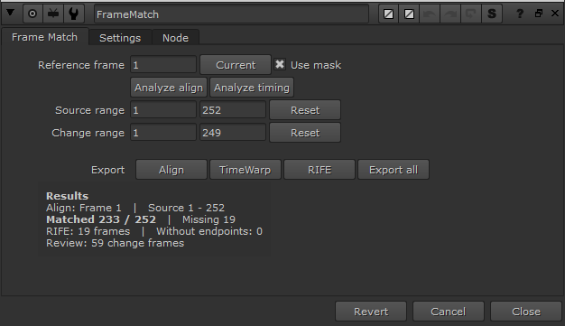

# FrameMatch for Nuke

[한국어](README.md) · [English](README.en.md)

Seedance 같은 SaaS 영상 편집 플랫폼에서 발생한 프레임 드랍·홀드를 원본 영상과 비교해 찾고, RIFE로 자동 보간하는 Nuke 툴킷입니다.

[▶ 전체 데모 영상](docs/media/FrameMatch_Demo.mp4)

**Align → TimeWarp → RIFE** — 한 노드에서 분석하고, 편집 가능한 Nuke 노드로 내보냅니다. 색상은 변경하지 않습니다.

## 시작하기

1. [최신 릴리스](https://github.com/tardis7732/FrameMatch-for-Nuke/releases/latest)에서 **FrameMatch-Windows.zip**을 받아 압축을 풉니다.
2. NukeX와 [Cattery RIFE](https://github.com/rafaelperez/RIFE-for-Nuke#installation)를 준비합니다. RIFE 모델은 별도 설치입니다.
3. [설치 방법](docs/USAGE.md#설치와-실행)에 따라 Python·gizmo와 OFX를 등록합니다.
4. NukeX를 열고 Tab → **FrameMatch**.

## 사용법

1. **Change**에 수정 영상, **Source**에 원본 영상을 연결합니다. Mask는 Align에 필요할 때만 연결합니다.
2. **Source range / Change range**에 시작·끝 프레임을 설정합니다. 각 줄의 **Reset**은 해당 입력 범위를 읽습니다. Source 범위가 최종 출력 타임라인입니다.
3. 위치를 맞추려면 **Reference frame**을 지정하고 **Analyze align**을 누릅니다. **Current**는 현재 프레임을 선택하고, **Use mask**는 Align에서만 마스크를 사용합니다. 실제 MatchGrade로 분석한 **Transform → Reformat**이 Change 아래에 생성됩니다.
4. **Analyze timing**을 누릅니다. 저장된 Align이 있으면 적용하고, 없으면 Change 그대로 분석합니다. Align을 자동으로 새로 분석하지는 않습니다. 완료되면 **TimeWarp → RIFE**가 연결됩니다.
5. 생성된 RIFE 출력에 Viewer를 연결해 확인합니다. FrameMatch 자체는 분석 데이터만 저장하며 Change를 그대로 출력합니다.

### Export

| 버튼 | 출력 |
| --- | --- |
| **Align** | Transform + Reformat 한 세트 |
| **TimeWarp** | 원본 타임라인에 맞춘 프레임 대응 |
| **RIFE** | 누락 구간 보간 Group. 해당 TimeWarp 뒤에 연결 |
| **Export all** | Align → TimeWarp → RIFE 전체 체인. Align 데이터가 없으면 TimeWarp → RIFE |

Analyze는 연결된 출력을 생성·갱신합니다. 수동 Export는 첫 입력이 연결되지 않은 독립 복사본이며, Export all은 내보낸 노드끼리만 순서대로 연결합니다. Change 입력에는 원래 수정 영상을 유지하세요.

### RIFE와 Results

RIFE는 **입력 하나**에서 양끝 정상 프레임을 가져옵니다. 출력 155가 비면 154·156으로 하나를, 155–157이 비면 154·158로 세 프레임을 만듭니다. 양끝이 없는 구간은 채우지 않습니다.

하단 **Results**에서 Matched / Missing, 보간할 RIFE 프레임 수, 양끝이 없는 Without endpoints, 확인이 필요한 Review를 볼 수 있습니다. Settings의 RIFE GPU·detail·resolution은 새로 내보내는 출력에 적용됩니다.

설치 경로, 마스크 사용 방식, 결과 항목별 의미와 오류 해결은 [전체 사용법](docs/USAGE.md)을 참고하세요.

## 예제

같은 [릴리스](https://github.com/tardis7732/FrameMatch-for-Nuke/releases/latest)의 **FrameMatch-Sample-Media.zip**을 패키지 폴더에 풀고, NukeX에서 `examples/FrameMatch_demo.nk`를 여세요.

**Source 252프레임 + Change 249프레임(ProRes)**과 연결된 예제 프로젝트를 제공합니다. 데모는 실제 Nuke 출력이며, 155프레임을 154·156으로 보간하는 장면을 포함합니다.

[전체 사용법](docs/USAGE.md) · [라이선스 / 출처](THIRD_PARTY.md)

Windows / NukeX 17.0v3에서 확인했습니다. 정방향 단일 샷용이며, 매칭과 보간 결과는 직접 확인하세요. Foundry 공식 플러그인은 아닙니다.
